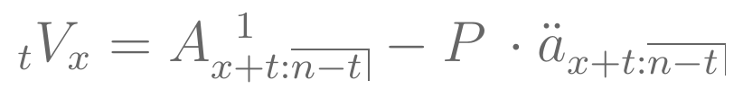
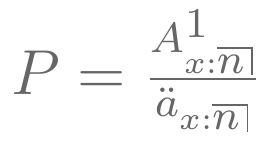
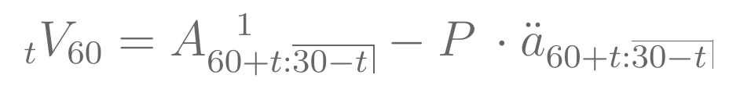
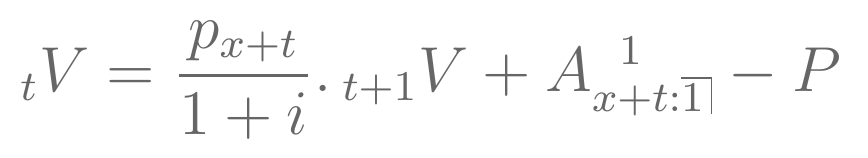
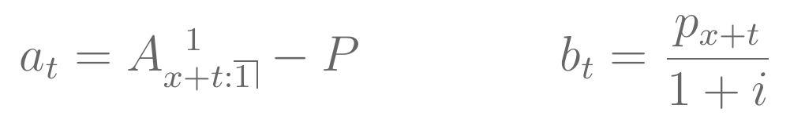

```{r echo=FALSE, warning=FALSE, purl=FALSE}
library(knitr)
```

```{r echo=FALSE}
## EST053 - Métodos Computacionais para Análise de Risco
## Código da aula 15 - Reservas

```

```{r echo=FALSE, purl=FALSE}
file_name = "15-reservas"
```

## Aula de Hoje

-   Definição de Reservas

-   Fórmulas de cálculo

    -   método retrospectivo
    -   **método prospectivo**
    -   **fórmula recursiva**

-   Exemplos

## Reservas

-   A [**reserva**]{.black} de uma apólice consiste no valor que a seguradora precisa ter em um determinado momento para, juntamente com os prêmios futuros que venha a receber, consiga honrar com seus pagamentos futuros de indenizações.

-   Para o cálculo da reserva no tempo $t$, assumimos que o segurado está vivo.

## Cálculo de Reservas

Reservas podem ser calculadas através de dois métodos:

-   [**Prospectivo:**]{.black} a reserva é calculada como a diferença entre os valores presentes atuariais dos benefícios futuros e dos prêmios futuros.

$${}_{t}V = VPA(\mbox{benefícios futuros}) - VPA(\mbox{prêmios futuros}) $$

-   [**Retrospectivo:**]{.black} a reserva é calculada como a diferença entre os valores acumulados dos benefícios pagos e os prêmios recebidos.

Para os exemplos dessa aula, vamos considerar a *reserva prospectiva* e os seguros discretos.

## Reserva Prospectiva

-   Reserva Prospectiva no tempo $t$ para um seguro de vida inteira para um indivíduo de idade $x$:

$${}_{t}V_x = A_{x+t} - P \,\cdot \ddot{a}_{x+t} $$

onde $P=\frac{A_x}{\ddot{a}_x}$ é o prêmio anual calculado no tempo $t=0$.

## [**Exemplo**]{.green3} {.build}

-   Calcule a reserva em $t=10$ para um **seguro de vida inteira** para um indivíduo de 60 anos pago com prêmios anuais.

```{r echo=FALSE, message=FALSE, warning=FALSE}
require(lifecontingencies)

## carregar tabela atuarial
data("soa08Act")


## Exemplo 1 - reserva para seguro de vida inteira
```

```{r purl=TRUE}
## prêmio
(P = Axn(soa08Act,60)/axn(soa08Act,60))
```

```{r purl=TRUE}
## reserva t=10
(V = Axn(soa08Act,60+10)-P*axn(soa08Act,60+10))
```

## Reserva Prospectiva

-   Reserva Prospectiva no tempo $t$ para um seguro de vida temporário por $n$ anos para um indivíduo de idade $x$:

```{r fig.align='center', echo=FALSE, purl=FALSE, out.width="60%"}

```

onde $P$ é o prêmio anual calculado no tempo $t=0$.

```{r fig.align='center', echo=FALSE, purl=FALSE, out.width="15%"}

```

## [**Exemplo**]{.green3} {.build}

-   Calcule a reserva em $t=10$ para um **seguro de vida temporário** por 30 anos para um indivíduo de 60 anos pago com prêmios anuais.

```{r echo=FALSE}

## Exemplo 2 - reserva para seguro de vida temporário

## prêmio
## 

## reserva t=10
##

```

```{r purl=FALSE}
## prêmio
P = Axn(soa08Act,60,30)/axn(soa08Act,60,30)

```

```{r purl=FALSE}
## reserva t=10
(V = Axn(soa08Act,60+10,30-10)-P*axn(soa08Act,60+10,30-10))
```

## Reserva em função do tempo

-   Vamos visualizar a evolução da reserva com o tempo.

-   Para isso, vamos considerar o **seguro temporário** por 30 anos para um segurado de 60 anos.

-   Para $t=0,1,\dots,30$, a reserva é dada por:

```{r fig.align='center', echo=FALSE, purl=FALSE, out.width="60%"}

```

## Reserva em função do tempo

```{r echo=FALSE}

## Gráfico da reserva com tempo

## 1) Crie uma função V para avaliar a reserva no tempo t

## 2) Avalie a função para t=0,...,30
## Dica: usar a função 'Vectorize'

## 3) Faça o gráfico

```

```{r fig.align='center', echo=FALSE, purl=FALSE}
V = function(t) Axn(soa08Act,60+t,30-t)-P*axn(soa08Act,60+t,30-t)
t = 0:30
V = Vectorize(V)(t)
plot(t, V, type="b", pch=20, main="Reserva de seguro temporário por 30 anos")

```

## [**Exemplo**]{.green3} {.build}

E se a duração de pagamento dos prêmios é *menor* do que a duração do seguro? <br><br>

-   Considere um seguro de vida temporário por 40 anos para um indivíduo de 25 anos. Os prêmios são pagos antecipadamente e anualmente, por no máximo 5 anos.

-   Calcule a reserva prospectiva nos tempos $t=3$ e $t=10$.

```{r echo=FALSE}

## Exemplo 3 - reserva para seguro temporario com duração diferente para prêmios

## prêmio
##

## reserva t=3
##

## reserva t=10
##

```

```{r echo=FALSE, purl=FALSE}
## prêmio
P = Axn(soa08Act,x=25,n=40)/axn(soa08Act,x=25,n=5)

## reserva t=3
( V3 = Axn(soa08Act,x=25+3,n=40-3)-P*axn(soa08Act,x=25+3,n=5-3) )

## reserva t=10
(V10 = Axn(soa08Act,x=25+10,n=40-10) )

```

## [**Exemplo**]{.green3} {.build}

-   Calcule a reserva prospectiva no tempo $t=10$ para um **seguro dotal misto** com duração de 20 anos para um segurado de 60 anos.

```{r echo=FALSE}

## Exemplo 4 - reserva para seguro dotal misto

```

```{r echo=TRUE, purl=TRUE}
## prêmio
(P = AExn(soa08Act, 60,20)/axn(soa08Act, 60,20))

## reserva t=10
( V = AExn(soa08Act, 60+10,20-10)-P*axn(soa08Act, 60+10,20-10) )
```

## [**Exemplo**]{.green3} {.build}

-   Considere um contrato de **anuidade vitalícia diferida** por 20 anos para um segurado de 55 anos. Os pagamentos da anuidade são antecipados, e os prêmios são pagos anualmente durante o período de diferimento.

-   Calcule a reserva prospectiva no tempo $t=10$ e $t=30$.

```{r echo=FALSE}

## Exemplo 5 - reserva para anuidade vitalícia diferida

## prêmio
##

## reserva t=10
##

## reserva t=30
##

```

```{r echo=FALSE, purl=FALSE}
## prêmio
P = axn(soa08Act,x=55,m=20)/axn(soa08Act,x=55,n=20)

## reserva t=10
( V10 = axn(soa08Act,x=55+10,m=20-10)-P*axn(soa08Act,x=55+10,n=20-10) )

## reserva t=30
( V30 = axn(soa08Act,x=55+30) )

```

## Fórmula Recursiva

-   Podemos encontrar o valor das reservas de maneira iterativa.

$${}_{t}V = {}_{t+1}V + VPA(\mbox{benefícios em } (t,t+1) ) - VPA(\mbox{prêmios em } (t,t+1)) $$

-   Assim, é possível determinar reservas usando fórmulas recursivas, já que no tempo $t=0$ a reserva deve ser zero.

## Fórmula Recursiva Geral

-   Considere uma sequência $\boldsymbol u = (u_n)$ satisfazendo a equação:

$$u_n = a_n + b_n .\, u_{n+1} $$

para todo $n=1,2,\dots,m$ tal que $u_{m+1}$ é conhecido, assim como $\boldsymbol a = (a_n)$ e $\boldsymbol b = (b_n)$.

-   A fórmula recursiva para a reserva se encaixa nessa fórmula geral, assim como muitas funções atuariais como $A_x$, $\ddot{a}_x$ e até $e_x$.

## Fórmula Recursiva Geral

-   A solução geral para essa fórmula é dada por:

$$ u_n = \frac{u_{m+1} \prod_{i=1}^m b_i + \sum_{j=n}^m a_j \prod_{i=0}^{j-1} b_i}{\prod_{i=0}^{n-1} b_i} $$

onde $b_0=1$.

```{r echo=FALSE}

## Fórmula recursiva

```

```{r}
## função para encontrar solução para fórmula recursiva
recurrent = function(a,b,ufinal){
  s <- rev(cumprod(c(1, b)))
  return( ( rev(cumsum(s[-1]*rev(a))) + s[1]*ufinal )/rev(s[-1]) )
}

```

## Fórmula Recursiva - Reservas

-   Vamos considerar o exemplo anterior de **seguro de vida temporário** por 30 anos para um indivíduo de 60 anos.

-   Fórmula recursiva:

```{r fig.align='center', echo=FALSE, purl=FALSE, out.width="60%"}

```

## Fórmula Recursiva - Reservas

-   De acordo com a equação recursiva geral, temos que $m=n$, $u_{m+1}=0$.

-   Logo, os termos da fórmula recursiva para a reserva ${}_{t}V$ são:

```{r fig.align='center', echo=FALSE, purl=FALSE, out.width="60%"}

```

## Fórmula Recursiva - Reservas

-   Assim, podemos encontrar o valor das reservas para $t=0,\dots,30$ usando a solução iterativa:

```{r}
## Exemplo - seguro temporário
## encontrando a reserva usando a fórmula recursiva

## prêmio
P = Axn(soa08Act,60,30)/axn(soa08Act,60,30)

## Sequências de a e b
Vecta = Vectorize(function(t) Axn(soa08Act,t,1))(60+0:29) - P
Vectb = Vectorize(function(t) pxt(soa08Act,t,1))(60+0:29)/1.06

## Sequência da reserva com a fórmula recursiva
Vectv = c(recurrent(a=Vecta,b=Vectb,ufinal=0),0)

```

## Fórmula Recursiva - Reservas

```{r echo=FALSE, fig.align='center'}
## gráfico das reservas
plot(0:30, Vectv, type="b", pch=20, main="Reserva de seguro temporário por 30 anos")

```

```{r include=FALSE, purl=FALSE}
# gerar arquivo com comandos do R
purl(input=paste0(file_name,".Rmd"),
     output=paste0("../labs/",file_name,".R"),
     documentation=0, encoding='UTF-8')
# Saída: 'filename.R' com apenas o código extraído do arquivo original
# Opções: documentation=1 inclui o texto no título dos chunks
# Para excluir um chunk do arquivo final, incluir a opção purl=FALSE no cabeçalho do chunk
```
