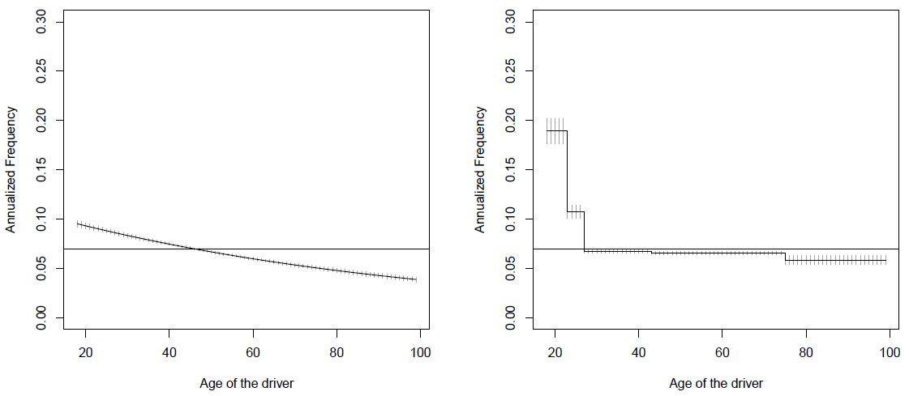
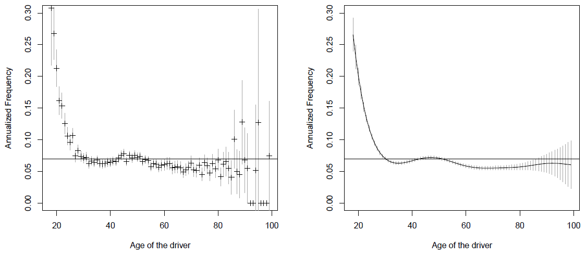

```{r echo=FALSE, warning=FALSE, purl=FALSE}
library(knitr)
```

```{r echo=FALSE}
## EST171 - Métodos Computacionais para Análise de Risco
## Código da aula 20 - Tarifação

```

```{r echo=FALSE, purl=FALSE}
file_name = "20-tarifacao"
```


## Aula de Hoje

- Modelo Coletivo para Tarifação de Seguros

- Modelo para a Frequência

  + Modelo Poisson

  + Exemplos


## Tarifação de Seguros

- Vimos na Parte III do curso como calcular Seguros e Anuidades de Vida, isto é, contratos cujos pagamentos dependem de eventos incertos relacionados à mortalidade e sobrevivência de vidas.

- Para calcular os prêmios desses seguros, precisamos determinar a distribuição de probabilidade da variável aleatória valor presente da perda futura da seguradora. Essa variável aleatória depende do tempo de vida futuro de um indivíduo, que é descrito através de uma tábua de vida.

- E para calcular um seguro de carro? E um seguro residencial? E um plano de saúde? (**Ramo Não-Vida**)


## Tarifação de Seguros

- Para seguros do **Ramo Não-Vida**, vamos usar dados históricos para construir <span class="black">modelos de tarifação</span>.

- Vamos discutir o uso de Modelos Lineares Generalizados em um exemplo para tarifação de seguros de automóveis.

- O objetivo é encontrar um <span class="blue3">**prêmio**</span> a ser cobrado de um segurado para uma apólice anual, baseado em *características observáveis* do segurado (como idade ou gênero) ou do objeto segurado (modelo e ano do carro, por exemplo).


# Modelo Coletivo


## Modelo Coletivo

<span class="black">Princípio do valor esperado:</span>

- o prêmio associado a um risco anual $S$ é

$$\pi(S) = (1+\alpha).\mathbb{E}(S) $$
onde $\alpha>0$ representa algum tipo de carregamento, e $S$ é a perda aleatória anual.


## Modelo Coletivo

- Seja $(N_t)$ o processo de contagem do número de sinistros ocorridos entre $[0,t]$, e $(Y_i)$ o valor da i-ésima indenização.

- Então a perda total no período $[0,t]$ é:

$$S_t = \sum_{i=1}^{N_t} Y_i $$
com $S_t=0$ se $N_t=0$.


## Prêmio Puro

- Se $\alpha=0$, o prêmio é chamado de <span class="blue3">**prêmio puro**</span>.

- Cobrar o prêmio puro pode ser justificado pela [Lei dos Grandes Números](https://pt.wikipedia.org/wiki/Lei_dos_grandes_n%C3%BAmeros), se assumirmos que as perdas são independentes e identicamente distribuídas.

- No entanto, de acordo com a [Teoria da Ruína](https://en.wikipedia.org/wiki/Ruin_theory), sabemos que a ruína será inevitável quando não há carregamento.


## Prêmio Puro

- O primeiro passo é calcular $\mathbb{E}(S)$ para $S=S_1$, o total anual.

- Se $N=N_1$ (número de indenizações no ano) e $Y_1,\dots,Y_N$ são independentes e as perdas $Y_i$ são i.i.d., então

$$\pi = \mathbb{E}(S) = \mathbb{E}(N) \cdot \mathbb{E}(Y) $$

- O <span class="blue3">**prêmio puro anual**</span> é o produto de dois termos:
  + a frequência anual $\mathbb{E}(N)$;
  + o custo médio das indenizações $\mathbb{E}(Y)$.


## Prêmio Puro considerando Heterogeneidade

- O prêmio puro do slide anterior considera apenas a média geral para todos os segurados, assumindo um risco homogêneo.

- No entanto, sabemos que um modelo mais realista seria considerar riscos diferentes, ou *heterogeneidade*. 


## Prêmio Puro considerando Heterogeneidade

- Vamos considerar o caso em que a heterogeneidade pode ser observada através de uma variável binária $Z$ (por exemplo, risco baixo e risco alto com probabilidade 50% em cada).

- Vamos assumir que $N$ tem uma distribuição Binomial, com probabilidade 10% ou 20% de acordo com $Z$. E vamos considerar que a perda é determinística, $Y=100$.

- A seguradora tem duas opções:

a ) cobrar o mesmo prêmio para todos os segurados, $\pi = \mathbb{E}(S) = \mathbb{E}(N) \cdot \mathbb{E}(Y) = 15$

b ) cobrar um prêmio considerando a heterogeneidade, $\pi(z) = \mathbb{E}(S|Z=z) = 10 \mbox{ ou } 20$ dependendo de $z$.


## Prêmio Puro considerando Heterogeneidade

- Isso pode ser perigoso se existirem duas seguradoras com modelos diferentes de tarifação. Os segurados de baixo risco irão preferir a seguradora que cobrar de acordo com b), enquanto segurados de alto risco irão preferir a seguradora que cobrar a).

- Por isso, a seguradora que não levar em conta a heterogeneidade, e não cobrar prêmios de acordo com as características individuais, não irá sobreviver em um mercado competitivo.

- Nesse exemplo, a seguradora deve cobrar:

$$\pi(z) = \mathbb{E}(S|Z=z) = \mathbb{E}(N|Z=z) \cdot \mathbb{E}(Y|Z=z) $$


## Prêmio Puro considerando Heterogeneidade

- O problema é que a **heterogeneidade** nem sempre é totalmente observável.

- Na prática, a seguradora poderá observar algumas informações, resumidas em um vetor $\boldsymbol{X}$, relacionadas às características do segurado, do objeto segurado, etc. 

- Algumas dessas <span class="blue3">**covariáveis**</span> podem fornecer uma boa aproximação para a variável latente $Z$. Nesse caso, a seguradora deve cobrar:

$$\pi(\boldsymbol{x}) = \mathbb{E}(S|\boldsymbol{X}=\boldsymbol{x}) = \mathbb{E}(N|\boldsymbol{X}=\boldsymbol{x}) \cdot \mathbb{E}(Y|\boldsymbol{X}=\boldsymbol{x}) $$


## Prêmio Puro considerando Heterogeneidade

- Nosso objetivo é propor modelos para estimar:

  + $\mathbb{E}(N|\boldsymbol{X}=\boldsymbol{x})$: a <span class="blue3">**frequência**</span> esperada de indenizações para segurados com características $\boldsymbol{x}$; e
  
  + $\mathbb{E}(Y|\boldsymbol{X}=\boldsymbol{x})$: a <span class="blue3">**severidade**</span>, ou custo médio das indenizações para segurados com características $\boldsymbol{x}$.
  

# Modelo para a Frequência


## Modelo para a Frequência

- Vamos começar considerando modelos para a frequência de indenizações $\mathbb{E}(N|\boldsymbol{X}=\boldsymbol{x})$.

- Como estamos falando de contagens de eventos, a primeira opção é considerar a distribuição de Poisson.


## Modelo Poisson

- Assuma que o número de indenizações para um segurado siga um [Processo de Poisson homogêneo](https://pt.wikipedia.org/wiki/Processo_de_Poisson#Processo_de_ponto_de_Poisson_homog%C3%AAneo) 
com intensidade $\lambda$.
 
- Isso quer dizer que o número de eventos tem incrementos independentes, e que a quantidade de indenizações observadas durante o intervalo de tempo $[t,t+h]$ tem distribuição Poisson($\lambda \cdot h$).


## Modelo Poisson | Exposição

- Para um segurado $i$, muitas vezes não temos o número de indenizações anual, isto é, $N_i$ para o período $[0,1]$. 

- Mas normalmente temos no banco de dados o número observado de indenizações $Y_i$ durante o período $[0,E_i]$, onde $E_i$ é a <span class="blue3">**exposição**</span> do segurado no ano.

$$Y_i \sim \mbox{Poisson}(\lambda \cdot E_i) $$


## Modelo Poisson 

- Considere o modelo Poisson para um grupo de segurados em que todos tem a mesma intensidade $\lambda$.

- Para estimar $\lambda$, podemos usar máxima verossimilhança:

$$\mathcal{L}(\lambda,\boldsymbol{Y},\boldsymbol{E}) = \prod_{i=1}^n \frac{e^{-\lambda. E_i}(\lambda.E_i)^{Y_i}}{Y_i!} $$

$$\hat{\lambda} = \frac{\sum_{i=1}^n Y_i}{\sum_{i=1}^n E_i} $$


## Modelo Poisson 

- Como já falamos antes, faz sentido pensar que $\lambda$ dependa de características (covariáveis) de cada segurado.

$$Y_i \sim \mbox{Poisson}(\lambda_i \cdot E_i) $$

- Utilizando uma [função de ligação](https://support.minitab.com/pt-br/minitab/18/help-and-how-to/modeling-statistics/regression/supporting-topics/logistic-regression/link-function/) logarítmica ($\lambda_i = e^{\boldsymbol{X}'_i\boldsymbol{\beta}}$):

$$Y_i \sim \mbox{Poisson}\left(e^{ \boldsymbol{X}'_i\boldsymbol{\beta} + \log(E_i)} \right) $$

- É importante notar o papel da **Exposição** nesse modelo! O termo $\log(E_i)$ é chamado de <span class="blue3">*offset*</span> e é incluído como se fosse uma covariável, mas sem coeficiente.


## Modelo Poisson 

- Assim, para modelar a **frequência anual** de indenizações, ajustamos uma regressão de Poisson ao número observado de indenizações $Y$, incluindo as covariáveis $\boldsymbol{X}$ e o log da exposição $\log(E_i)$ como *offset*.

- Vamos considerar $\lambda_i = \exp(\boldsymbol{X}'_i \boldsymbol{\beta})$ (para garantir a positividade).

- A log-verossimilhança é dada por:

$$\log \mathcal{L}(\boldsymbol{\beta}; \boldsymbol{Y}, \boldsymbol{E}) = \sum_{i=1}^n \left[ Y_i \log(\lambda_i  E_i) - (\lambda_i E_i) - \log(Y_i!) \right] \\ 
\hspace{6cm} = \sum_{i=1}^n  \left[ Y_i \cdot \left( \boldsymbol{X}'_i \boldsymbol{\beta} + E_i \right) - \exp\left\{ \boldsymbol{X}'_i \boldsymbol{\beta} + \log(E_i) \right\} - \log(Y_i!) \right]  $$


## Modelo Poisson 

- O estimador de máxima verossimilhança para $\boldsymbol{\beta}$ pode ser encontrado numericamente usando o [algoritmo de Newton-Raphson](https://pt.wikipedia.org/wiki/M%C3%A9todo_de_Newton-Raphson).

- Esse método está implementado na função `glm` do R.

```{r eval=FALSE, purl=FALSE}
glm(Y~X1+X2+X3+offset(E), family=poisson(link="log"))
```


## <span class="green3">**Exemplo**</span>

- Vamos considerar o banco de dados `freMTPLfreq` de seguros automobilísticos contra terceiros na França.

- Carregue os dados e veja as variáveis disponíveis.

```{r echo=FALSE, message=FALSE, warning=FALSE}
require(CASdatasets)

## Dados de seguros contra terceiros - França
data(freMTPLfreq)
?freMTPLfreq

```


## <span class="green3">**Exemplo**</span>

- Antes de ajustar o modelo, vamos categorizar algumas variáveis:

```{r results='hide'}
## categorizando variáveis
freMTPLfreq.f <- freMTPLfreq
freMTPLfreq.f$DriverAge <- cut(freMTPLfreq$DriverAge,c(17,22,26,42,74,Inf))
freMTPLfreq.f$CarAge <- cut(freMTPLfreq$CarAge,c(0,1,4,15,Inf),include.lowest=TRUE)
freMTPLfreq.f$Density <- cut(freMTPLfreq$Density,c(0,40,200,500,4500,Inf),include.lowest=TRUE)

## verificando as classes de cada variável
summary(freMTPLfreq.f)

```


## <span class="green3">**Exemplo**</span>

- Ajuste um modelo de Poisson para o número de indenizações, considerando a exposição (log) como *offset*, e as covariáveis:

  + tipo de combustível;
  
  + idade do motorista;
  
  + e a densidade populacional da cidade.

(Obs: considere as variáveis categorizadas)

```{r echo=FALSE}
## Modelo Poisson 1
##

```


## <span class="green3">**Exemplo**</span> {.smaller}

```{r echo=FALSE, purl=FALSE}
reg = glm(ClaimNb ~ Gas + DriverAge + Density + offset(log(Exposure)),
          family=poisson,data=freMTPLfreq.f)
summary(reg)
```


## Tarifação | Modelo com uma variável categórica

- Vamos considerar apenas uma covariável: tipo de combustível (diesel ou regular).

```{r echo=FALSE}
## Modelos de tarifação
## com uma variável categórica

```

```{r}
vY <- freMTPLfreq.f$ClaimNb   # selecionando Y
vE <- freMTPLfreq.f$Exposure  # selecionando E
X1 <- freMTPLfreq.f$Gas       # selecionando X1

```

```{r}
## Frequência de indenizações por tipo de combustível
tapply(vY, X1, sum)/tapply(vE, X1, sum)

```


## Tarifação | Modelo com uma variável categórica

- Vamos ajustar um modelo de Poisson com essa covariável e **sem intercepto**:

```{r results='hide'}
## modelo sem intercepto
df <- data.frame(vY,vE,X1)
regpoislog <- glm(vY~0+X1+offset(log(vE)),data=df,family=poisson(link="log"))
summary(regpoislog)

```


## Tarifação | Modelo com uma variável categórica

- Interpretando os coeficientes:

```{r}
## exponencial dos coeficientes
##
exp(coef(regpoislog))
```


## Tarifação | Modelo com uma variável categórica

- Modelo **com intercepto**:

```{r results='hide'}
## modelo com intercepto
regpoislog <- glm(vY~X1+offset(log(vE)),data=df,family=poisson(link="log"))
summary(regpoislog)

```

- Interpretando os coeficientes:

```{r}
## exponencial dos coeficientes
##
exp(coef(regpoislog))
```


## Tarifação | Modelo com uma variável categórica

- Nesse modelo, a categoria de referência é `Diesel` que tem frequência de 0,0746.

- Para tipo de combustível `Regular`, a frequência seria 87,25% da categoria de referência (igual a 0,0651).

- Essa seria a frequência estimada para calcular o prêmio.


## Tarifação | Modelo com covariáveis contínuas

- Categorizamos algumas variáveis arbitrariamente. E se quisermos trabalhar com as variáveis contínuas?

<span class="green3">**Exercício:**</span>

- Ajuste um modelo de Poisson incluindo apenas a idade categorizada do motorista como covariável (e o *offset*).

- Compare esse ajuste com um modelo com a idade contínua.

```{r echo=FALSE}
## Modelo com covariável contínua

## modelo com idade categórica
##

## modelo com idade contínua
##

```


## Tarifação | Modelo com covariáveis contínuas

- Uma limitação desse modelo é restringir a uma relação linear entre o número de indenizações e a idade.

- Alternativas:

  + considerar idade como um fator (uma categoria diferente para cada idade): `as.factor(DriverAge)`
  
  + modelo não-paramétrico incluindo uma função $s(X)$ da idade, onde $s()$ pode ser um *spline* (curva definida entre dois nós). Esse modelo pode ser implementado com a função `gam` do pacote `mgcv`.
  

## Tarifação

- Comparação entre a predição dos modelos para idade:

```{r fig.align='center', echo=FALSE, purl=FALSE, out.width="100%"}

``` 


## Tarifação

```{r fig.align='center', echo=FALSE, purl=FALSE, out.width="100%"}

``` 


[//]: # ##########################################################
[//]: # Para gerar arquivo com apenas os comandos do R desta aula
```{r include=FALSE, purl=FALSE}
# gerar arquivo com comandos do R
purl(input=paste0(file_name,".Rmd"),
     output=paste0("../labs/",file_name,".R"),
     documentation=0, encoding='UTF-8')
# Saída: 'filename.R' com apenas o código extraído do arquivo original
# Opções: documentation=1 inclui o texto no título dos chunks
# Para excluir um chunk do arquivo final, incluir a opção purl=FALSE no cabeçalho do chunk
```


