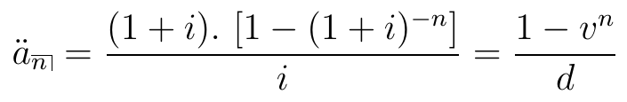
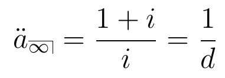
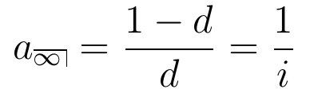
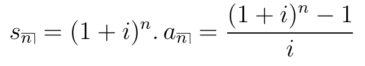

```{r echo=FALSE, warning=FALSE, purl=FALSE}
library(knitr)
```

```{r echo=FALSE}
## EST171 - Métodos Computacionais para Análise de Risco
## Código da aula 12 - Revisão de Matemática Financeira

```

```{r echo=FALSE, purl=FALSE}
file_name = "12-matematica_financeira"
```


## Aula de Hoje

- Matemática Financeira

  + taxa de juros e taxa de desconto
  
  + taxa efetiva e nominal
  
  + fluxo de pagamentos e anuidade certas


## Matemática Financeira

- A <span class="black">Matemática Financeira</span> lida com o valor do dinheiro no tempo.

- Vamos ver uma revisão de algumas quantidades e conceitos básicos que precisaremos para avaliar pagamentos futuros.

- Muitas dessas funções estão implementadas no R no pacote `lifecontingencies`.

<div class="centered">
  
</div>


# Taxa de Juros e Taxa de Desconto


## Taxa de Juros

- Um capital $X$ irá valer $A(t) = X \cdot (1+i)^t$ depois de $t$ anos, se seguir a lei de *juros compostos*.

- $i$ é a <span class="blue3">**taxa de juros**</span> efetiva anual, isto é, a quantidade que um investimento irá render após um ano, com juros pagos no final do ano.

- $(1+i)^n$ é chamado de <span class="blue3">fator de acumulação</span>.


## Taxa de Desconto

- E se o pagamento dos juros fosse feito <span class="blue3">**antecipadamente**</span> (no começo do período)? Os juros recebidos seriam reinvestidos, gerando mais juros, que também seriam investidos... e assim sucessivamente.

- Vamos chamar de *taxa de juros antecipados* ou <span class="blue3">**taxa de desconto**</span> $d$.

- No final do período, o montante seria $X + d. X + d^2.X + ... = X \left(\frac{1}{1-d}\right)$ (progressão geométrica).

- A <span class="blue3">**taxa de desconto**</span> que leva ao mesmo capital obtido com uma <span class="blue3">**taxa de juros**</span> $i$ é dada por:

$$ X \cdot (1+i) = X \cdot \left( \frac{1}{1-d} \right) \qquad\Rightarrow \qquad   d = \frac{i}{1+i} $$


## Taxa de Desconto

- Por exemplo, qual deve ser a taxa de juros antecipada (ou taxa de desconto) que leva ao mesmo fator de acumulação de uma taxa de juros de 5%?

No R:

```{r echo=FALSE, message=FALSE, warning=FALSE}
## Taxa de Juros e Taxa de Desconto
require(lifecontingencies)

```

```{r}
0.05/(1+0.05)
interest2Discount(i=0.05)
```


## Taxa de Desconto

- Também podemos ver a **taxa de desconto** como o valor descontado dos juros $i$ a serem pagos no final do ano.

$$ d = \frac{i}{1+i} = i \, . \frac{1}{1+i} = i\,.(1-d)$$

Considere um capital investido de 1 unidade. O valor do *juros antecipado* $d$ a ser pago é igual ao que renderia de *juros postecipado* $i$ aplicado ao capital de $1-d$.


Equivalentemente, o valor do *juros postecipado* $i$ é igual ao que receberia de *juros antecipado* $d$ aplicado ao capital de $1+i$.

$$ i = \frac{d}{1-d} = d \, .(1+i)  \qquad \Rightarrow \qquad (1-d) = \frac{1}{1+i} $$ 


## Taxa nominal e efetiva

- Juros pode ser pago em frequências maiores do que uma vez por período de tempo. 

- Essas frações do período em que os juros são pagos são chamadas de <span class="blue3">**período de conversão**</span>.

- Quando o *período de conversão* é igual à unidade de tempo básica, a taxa de juros (e a de desconto) recebe o nome de <span class="black">**taxa efetiva**</span>.

- Quando o *período de conversão* é diferente da unidade de tempo básica, a taxa de juros (e a de desconto) é chamada de <span class="black">**taxa nominal**</span>.


## Taxa nominal e efetiva

- Seja $i$ a <span class="black">**taxa de juros efetiva**</span> anual.

- Seja $i^{(m)}$ a <span class="black">**taxa de juros nominal**</span> anual, convertida em $m$ vezes por ano.

Logo,

$$ \left( 1 + \frac{i^{(m)}}{m}\right)^m = (1+i) $$

$$ i^{(m)} = m . \left[ (1+i)^{1/m} - 1\right] $$


## Taxa nominal e efetiva

```{r}
## Taxa Nominal e Efetiva
nominal2Real(i=0.06, k=12)
real2Nominal(i=0.06, k=12)

```
```{r}
# converter taxa de desconto efetiva para nominal
real2Nominal(i=0.04, k=12, type="discount") 

```


## Relações úteis

- Valor do montante de 1 unidade acumulado pelo tempo $t$:

$$A(t) = (1+i)^t = \left( 1 + \frac{i^{(m)}}{m} \right)^{t.m} = \left(1 - \frac{d^{(m)}}{m} \right)^{-t.m} = (1-d)^{-t} = v^{-t} $$

onde $i$ e $d$ são as taxas de juros e desconto efetivas, e $i^{(m)})$ e $d^{(m)}$ são as taxas nominais.


## <span class="green3">**Exercício 1**</span> {.build}

Encontre o valor presente de $1.000 a ser pago no final de 6 anos com juros de 6% ao ano, pago antecipadamente e convertido semestralmente.

```{r echo=FALSE}
## Exercício 1
##

```

```{r purl=FALSE}
1000*(1-0.06/2)^12

annualDiscount = nominal2Real(i=0.06, k=2, type="discount")
i = discount2Interest(annualDiscount)
presentValue(cashFlows=1000, timeIds=6, interestRates=i, probabilities=1)

```


# Fluxo de Pagamentos


## Fluxo de Pagamentos

- Muitas vezes precisamos considerar mais de um pagamento ou pagamentos que são feitos periodicamente.

- <span class="black">**Valor Presente**</span>: capital em valor atual correspondente a uma série de pagamentos feitos em diferentes tempos.

- Permite comparar em uma *mesma base* diferentes fluxos de pagamentos. Isso é, podemos avaliar o retorno de diferentes investimentos.


## Fluxo de Pagamentos

$$VP = \sum_{j=1}^K P_j \,(1+i_j)^{-t_j} $$

onde $P_j$ é o valor do pagamento e $i_j$ é a taxa de juros correspondentes ao tempo $t_j$.

- O pacote `lifecontingencies` também tem funções para calcular **Valor Presente** de fluxos de pagamentos *determinísticos*. 


## <span class="green3">**Exercício 2:**</span>

Usando a função `presentValue`, verifique qual investimento é melhor (com $i=5\%$):

1) Pagar \$500 agora e receber \$100, \$200, \$300, \$250 no final dos próximos quatro anos;

2) Pagar \$700 agora e receber \$1000 no final do segundo ano.


## <span class="green3">**Exercício:**</span>

```{r echo=FALSE}

## Exercício 2
##

```

```{r purl=FALSE}
pg1 = c(-500,100,200,300,250)
t1 = 0:4
(VP1 = presentValue(cashFlows=pg1, t=t1, i=0.05))

pg2 = c(-700,1000)
t2 = c(0,2)
(VP2 = presentValue(cashFlows=pg2, t=t2, i=0.05))
```


## Anuidades

<span class="black">**Anuidades**</span> são fluxos de pagamentos feitos em intervalos regulares de tempo.

- Se os pagamentos são feitos *garantidamente* durante um tempo, chamamos de <span class="black">anuidades certas</span>.

- Se os pagamentos são feitos no *final de cada período*, chamamos de <span class="black">anuidades postecipadas</span> ("*annuity-immediate*").

- Se os pagamentos são feitos no *começo de cada período*, chamamos de <span class="black">anuidades antecipadas</span> ("*annuity-due*").

- Anuidades também podem ser pagas em *pagamentos fracionários* dentro de cada período, ou *indefinidamente* (Bowers et al., 1997; Dickson et al., 2009).


## Anuidades

- Anuidade certa postecipada por $n$ anos:

```{r fig.align='center', out.height="5%", echo=FALSE, purl=FALSE}
include_graphics("img/anuidade.png") 
```

- Anuidade certa antecipada por $n$ anos:

```{r fig.align='center', fig.height=0.5, echo=FALSE, purl=FALSE}
 
```


## Perpetuidades

- Perpetuidades (anuidade infinita) antecipada e postecipada:

```{r fig.align='center', fig.height=0.5, echo=FALSE, purl=FALSE}

```

```{r fig.align='center', fig.height=0.5, echo=FALSE, purl=FALSE}
 
```


Podemos calcular com a função `annuity`.


## <span class="green3">**Exercício 3:**</span>

a) Encontre o valor presente de uma anuidade postecipada de $100 paga anualmente por 5 anos, com juros de 9%.
<br><br>

b) Suponha que uma empresa emita um contrato de dividendo de ações que paga $10 no final do ano indefinidamente, com juros de 6%. Qual o valor presente deste contrato?
<br><br>

c) Qual o valor que você deve investir hoje, com juros compostos anuais de 6%, para sacar $5000 no começo de cada ano nos próximos 5 anos?


## <span class="green3">**Exercício:**</span>

```{r echo=FALSE}

## Exercício 3
##

```

```{r purl=FALSE}
i = 0.09
n = 5
100*(1-(1+i)^(-n))/i

100*annuity(i=0.09, n=5, type="immediate")
```


## <span class="green3">**Exercício:**</span>

```{r purl=FALSE}
i = 0.06
10*1/i

10*annuity(i=0.06, n=Inf)
```


## <span class="green3">**Exercício:**</span>

```{r purl=FALSE}
i = 0.06
n = 5
5000*(1+i)*(1-(1+i)^(-n))/i

5000*annuity(i=0.06, n=5, type="due")
```


## Valor Acumulado

- Também podemos definir o <span class="black">**valor acumulado**</span> ou valor futuro de uma série de pagamentos.

```{r fig.align='center', fig.height=0.5, echo=FALSE, purl=FALSE}
 
```

Podemos calcular com a função `accumulatedValue`.


## <span class="green3">**Exercício 4:**</span> {.build}

1) Qual será o valor acumulado se depositarmos $5000 no começo de cada ano pelos próximos 5 anos? Considere juros compostos de 6%.

```{r echo=FALSE}

## Exercício 4
## 

```

```{r purl=FALSE}
annuity(i=0.06, n=5, type="due")*5000*1.06^5
5000*accumulatedValue(i=0.06, n=5,type="due")
```


## <span class="green3">**Exercício 5:**</span> {.build}

Um homem quer economizar $100.000 para pagar a faculdade de seu filho daqui a 10 anos. Um fundo de educação exige que o investidor faça depósitos fixos no final de cada ano, com uma taxa de juros garantida de 5%. Quanto o homem precisa depositar a cada ano para atingir sua meta?

```{r echo=FALSE}

## Exercício 5
## 

```

```{r purl=FALSE}
C = 100000
R = C/accumulatedValue(i=0.05,n=10)
R
```


## Fluxos de pagamentos 

- Também podemos querer encontrar o **valor presente** ou **valor acumulado** de uma série de pagamentos *não constantes*.

- Todos os casos podem ser avaliados com a fórmula do VP que vimos no começo da aula.

- Mas vamos encontrar expressões para alguns casos específicos, como <span class="black">**anuidades aritmeticamente crescentes**</span> $(IA)_n$ e <span class="black">**anuidades aritmeticamente decrescentes**</span> $(DA)_n$.

- No R: `increasingAnnuity` e `decreasingAnnuity`.


## <span class="green3">**Exercício 6:**</span> 

- Os seguintes pagamentos serão recebidos:

  + $500 no final do primeiro ano, $520 no final do segundo ano, $540 no final do terceiro ano, e assim por diante, até o pagamento final de $800.

- Considerando uma taxa de juros anual de 2%, encontre o valor presente desses pagamentos no $t=0$.

- Encontre o valor acumulado desses pagamentos no momento do último pagamento.


## <span class="green3">**Exercício 6:**</span> 

```{r echo=FALSE}

## Exercício 6
## 

```

Podemos considerar uma anuidade fixa de \$480 mais uma anuidade crescente de \$20:

```{r purl=FALSE}
480*annuity(i=0.02,n=16)+ 20*increasingAnnuity(i=0.02,n=16)
```

Valor acumulado:

```{r purl=FALSE}
(480*annuity(i=0.02,n=16)+ 20*increasingAnnuity(i=0.02,n=16))*1.02^16
```


## Anuidade diferida

- Dizemos que uma **anuidade certa** é diferida se o momento de início dos pagamentos é diferente do momento em que estamos avaliando o fluxo de pagamentos.

- Isto é, a sequência de pagamentos só começará daqui a um determinado tempo (chamado de **período de diferimento**).


## <span class="green3">**Exercício 7:**</span> 

- Encontre o valor presente de uma anuidade antecipada que paga \$1200 anualmente por 12 anos, com o primeiro pagamento daqui a dois anos. Considere i=6%.

```{r echo=FALSE}

## Exercício 7
## 

```

```{r purl=FALSE}
1200*annuity(i=0.06,n=12,m=1,type="immediate")

1200*annuity(i=0.06,n=12,m=2,type="due")
```


[//]: # ##########################################################
[//]: # Para gerar arquivo com apenas os comandos do R desta aula
```{r include=FALSE, purl=FALSE}
# gerar arquivo com comandos do R
purl(input=paste0(file_name,".Rmd"),
     output=paste0("../labs/",file_name,".R"),
     documentation=0, encoding='UTF-8')
# Saída: 'filename.R' com apenas o código extraído do arquivo original
# Opções: documentation=1 inclui o texto no título dos chunks
# Para excluir um chunk do arquivo final, incluir a opção purl=FALSE no cabeçalho do chunk
```


