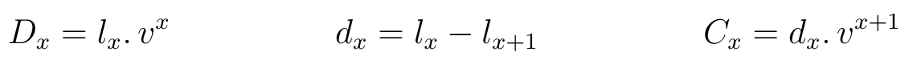
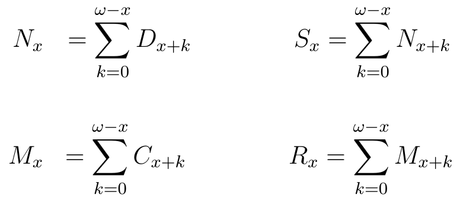
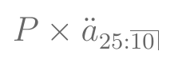

```{r echo=FALSE, warning=FALSE, purl=FALSE}
library(knitr)
```

```{r echo=FALSE}
## EST171 - Métodos Computacionais para Análise de Risco
## Código da aula 14 - Precificação de Seguros

```

```{r echo=FALSE, purl=FALSE}
file_name = "14-precificacao"
```


## Aula de Hoje

- Seguros de Vida

  + VPA de diferentes seguros
  + Fórmulas de Comutação
  + Seguros com Benefícios Crescentes
  + Seguros em m partes no ano
  
- Anuidades de Vida

  + VPA de diferentes anuidades
  + Fórmulas de Comutação
  
- Prêmios


## Seguros e Anuidades de Vida {.build}

- **Seguros de vida** ou **anuidades de vida** são contratos que prometem *um ou mais* pagamentos de acordo com a ocorrência de eventos relacionados à sobrevivência/mortalidade de indivíduos (*life-contingent events*).

- Por exemplo:

  + <span class="blue3">seguro de vida</span> que promete o pagamento de uma indenização caso o seguro morra durante o período definido no contrato;
  
  + contrato de <span class="blue3">anuidade</span> que paga uma quantia no começo (ou final) de cada período, até o final do contrato ou até a morte do segurado, o que ocorrer primeiro;
  
  + <span class="blue3">seguros dotais</span> que pagam uma indenização no menor entre o tempo até a morte do segurado e o final do contrato.


## Precificação de Seguros 

Etapas para calcular o **prêmio** de um seguro (preço a ser cobrado pelo contrato):

> 1. Determinar as <span class="blue3">**hipóteses financeiras e demográficas**</span> que serão usadas. Isto é, a <span class="blue3">taxa de juros</span> para descontar os pagamentos futuros, e a <span class="blue3">tabela de vida</span> com as probabilidades de sobrevivência.
> 2. Calcular o <span class="blue3">**Valor Presente Atuarial**</span> dos fluxos de caixa dependentes de sobrevivência/mortalidade do indivíduo, ou seja, o valor esperado dos benefícios prometidos no contrato e as despesas associadas.
> 3. Calcular o <span class="blue3">**prêmio**</span>, levando em conta que pode ser pago em uma única parcela (prêmio único) ou em parcelas periódicas.


## Notação

Seja:

- $x$ a idade do segurado no início do contrato;

- $n$ a duração do contrato;

- $m$ o período de diferimento, isto é, o período até que a cobertura do contrato se inicie;

- $i$ a taxa de juros;

- $k$ a frequência de pagamentos a cada ano.


## Hipóteses assumidas

- Para os exemplos dessa aula, vamos considerar:

  + Tabela de vida Ilustrativa do SOA;
  
  + taxa de juros de 6%.

- Também vamos assumir que os benefícios são pagos no final de cada período.


# Seguros de Vida


## Seguros de Vida

- O contrato padrão que vamos utilizar será o de <span class="blue3">seguro de vida temporário</span> por $n$ anos, que paga \$1 no final do ano de morte de $(x)$ se ocorrer antes de $n$ anos.

- VPA:

```{r fig.align='center', echo=FALSE, purl=FALSE}
include_graphics("img/Axn.png",dpi=99)
```


## Seguros de Vida

- No caso do <span class="blue3">seguro de vida inteira</span>, o VPA é obtido quando $n = \omega$.

- Para <span class="blue3">seguro diferido</span>, basta alterar os limites do somatório para $k=m$ até $n+m-1$.


## Funções de Comutação

- Antes da popularização dos computadores, o cálculo de seguros era feito com tabelas atuariais, tabelas prontas com funções da idade dos segurados.

- As <span class="black">**funções de comutação**</span> são funções de $l_x$ e da taxa de juros $i$.
<br><br>


## Funções de Comutação

```{r fig.align='center', echo=FALSE, purl=FALSE, out.width='90%'}

```
<br><br>

```{r fig.align='center', echo=FALSE, purl=FALSE, out.width='60%'}

```


## Funções de Comutação - Seguros

- VPA de Seguro de vida inteira:

```{r fig.align='center', echo=FALSE, purl=FALSE}
include_graphics("img/Ax.png",dpi=120)
```

- Seguro Dotal Puro:

```{r fig.align='center', echo=FALSE, purl=FALSE}
include_graphics("img/nEx.png",dpi=120)
```


## Funções de Comutação - Seguros

- VPA de Seguro de vida diferido:

```{r fig.align='center', echo=FALSE, purl=FALSE}
include_graphics("img/nAx.png",dpi=110)
```

- VPA de Seguro de vida temporário:

```{r fig.align='center', echo=FALSE, purl=FALSE}
include_graphics("img/seg_temp.png",dpi=120)
```


## Tabela Atuarial

- O pacote `lifecontingencies` contém funções para criar **tabelas atuariais** com <span class="red3">funções de comutação</span> a partir de uma tabela de vida.


## <span class="green3">**Exercício**</span>

- A partir da tabela de vida ilustrativa do SOA:

1) Construa uma *tabela atuarial* com juros de 6%;

2) Exporte essa tabela para um objeto `data.frame` com as funções de comutação.


## <span class="green3">**Exercício**</span>

```{r echo=FALSE, message=FALSE, warning=FALSE}
require(lifecontingencies)

## Exercício 1 - construir tabela atuarial a partir da tabela do SOA

```

```{r}
## carregar valores de l_x
data("soaLt")

## criar tabela atuarial
soaAct = new("actuarialtable", x=soaLt$x, lx=soaLt$Ix, interest=0.06)

```

```{r echo=FALSE, results='hide', message=FALSE}
class(soaAct)
?`actuarialtable-class`
summary(soaAct)

```

## <span class="green3">**Exercício**</span>

```{r}
## convertendo para data.frame
soaAct.df = as(soaAct, "data.frame")
head(soaAct.df)

```


## <span class="green3">**Exercício**</span>

- Vamos usar essa tabela de vida para encontrar o valor do prêmio único de um **seguro temporário** por 3 anos, para um segurado de 36 anos e soma segurada de \$100.000.

- VPA desse seguro:

```{r fig.align='center', echo=FALSE, purl=FALSE}
include_graphics("img/vpa.png",dpi=120)
```


## <span class="green3">**Exercício**</span>

```{r}
## Exemplo - Seguro temporário

## 1) usando somatório
## probabilidades
prob.morte = -diff(soaAct.df$lx)[soaAct.df$x%in%36:38]/soaAct.df$lx[soaAct.df$x==36]
prob.morte

```

```{r}
## fatores de desconto
disc = (1+0.06)^(-(1:3))
disc

```


## <span class="green3">**Exercício**</span>

```{r}
## valor presente atuarial
p1 = 100000*sum(disc*prob.morte)

```


## <span class="green3">**Exercício**</span>

- Usando funções de comutação:

```{r fig.align='center', echo=FALSE, purl=FALSE}
include_graphics("img/vpa2.png",dpi=120)
```

```{r}

## 2) usando funções de comutação
p2 = 100000*with(soaAct.df, (Mx[37]-Mx[40])/Dx[37])

```


## <span class="green3">**Exercício**</span>

```{r}

## 3) usando função seguro temporário
p3 = 100000*Axn(actuarialtable = soaAct, x=36, n=3)

```

```{r}
cbind(p1,p2,p3)

```


## Seguros com benefícios crescentes

- Outro tipo de contrato consiste em seguros com benefícios *crescentes* ou *decrescentes*, pagos no final do ano de morte.

- Por exemplo, considere um seguro temporário por $n$ anos que paga $k+1$ se $x$ completou $k$ anos desde o início do contrato, ou seja, se $K_x = k$ para $k=0,1,\dots,n-1$.

```{r fig.align='center', echo=FALSE, purl=FALSE}
include_graphics("img/IAx.png",dpi=120)
```


## Seguros com benefícios crescentes

- Seguros *temporários*, *crescentes* e *decrescentes* estão relacionados através da equação:

```{r fig.align='center', echo=FALSE, purl=FALSE}
include_graphics("img/seg_cresc.png",dpi=120)
```


## Seguros com benefícios crescentes

```{r}
## seguros com benefícios crescentes

(10+1)*Axn(soaAct, 60, 10)

IAxn(soaAct, 60, 10) + DAxn(soaAct, 60, 10)

```


## Seguros em m partes no ano

- Também podemos considerar seguros *pagos em m partes no ano*. Assim, estamos dividindo o ano em $m$ subperíodos, e os benefícios serão pagos no final da parte em que ocorrer a morte.

```{r fig.align='center', echo=FALSE, purl=FALSE}
include_graphics("img/Ax_mpartes.png",dpi=120)
```


## Seguros em m partes no ano

- Vamos verificar **numericamente** que 

```{r fig.align='center', echo=FALSE, purl=FALSE}
include_graphics("img/Axn_Axn_mpartes.png",dpi=120)
```

(sob suposição de distribuição uniforme de mortes - Seção 4.5 do Dickson)


## Seguros em m partes no ano

```{r}

## relação entre seguros anuais e em m partes
Axn(actuarialtable=soaAct,x=30,k=12)

0.06/real2Nominal(0.06,12)*Axn(actuarialtable=soaAct,x=30)

```


# Anuidades de Vida


## Anuidades de Vida

- Uma **anuidade de vida** é uma série de pagamentos feitos no começo (ou final) do ano enquanto o segurado estiver vivo.

- VPA de uma <span class="blue3">anuidade de vida inteira *antecipada*</span>:

$$\ddot{a}_x = \sum_{k=0}^\infty v^k . {}_{k}p_x $$

- VPA de uma <span class="blue3">anuidade de vida inteira *postecipada*</span>:

$$a_x = \sum_{k=1}^\infty v^k . {}_{k}p_x = \ddot{a}_x - 1 = {}_{1|}\ddot{a}_x$$


## Funções de Comutação - Anuidades

- VPA de Anuidade de vida inteira *antecipada*:

```{r fig.align='center', echo=FALSE, purl=FALSE}
include_graphics("img/anndue.png",dpi=120)
```

- VPA de Anuidade de vida inteira *postecipada*:

```{r fig.align='center', echo=FALSE, purl=FALSE}
include_graphics("img/annimmed.png",dpi=120)
```


## Funções de Comutação - Anuidades

- VPA de Anuidade de vida inteira *antecipada* e *diferida*:

```{r fig.align='center', echo=FALSE, purl=FALSE}
include_graphics("img/anndue_diferida.png",dpi=120)
```

- VPA de Anuidade de vida *antecipada* e *temporária*:

```{r fig.align='center', echo=FALSE, purl=FALSE}
include_graphics("img/anndue_temporaria.png",dpi=120)
```


## <span class="green3">**Exercício**</span> {.build}

- Vamos encontrar o VPA de uma série de pagamentos de \$1, feitos no começo de cada ano, para um segurado de 65 anos vitaliciamente.

```{r echo=FALSE}

## Exemplo - Anuidade vitalícia

```

```{r}
## 1) usando somatório
sum( (soaAct.df$lx)[soaAct.df$x%in%65:111]/soaAct.df$lx[soaAct.df$x==65]*1.06^(-(0:45)) )

```

## <span class="green3">**Exercício**</span> {.build}

```{r}
## 2) usando funções de comutação
with(soaAct.df, (Nx[66]/Dx[66]))

```

```{r}
## 3) usando função do pacote
axn(actuarialtable=soaAct,x=65)

```


## <span class="green3">**Exercício**</span> 

- Refaça os cálculos anteriores para <span class="blue3">anuidade postecipada</span>.

```{r}

## Exercício
## anuidade postecipada
##

```


## <span class="green3">**Exercício**</span> 

- Encontre o VPA de uma série de pagamentos de \$1000 feitos por um segurado entre as idades 25 e 45, no começo de cada ano enquanto estiver vivo.

```{r}

## Exercício
## VPA anuidade temporária
##

```


## <span class="green3">**Exercício**</span> 

- Encontre o VPA de uma série de pagamentos *postecipados* de \$150 feitos *mensalmente* e *vitaliciamente* por um segurado de 20 anos, *diferidos* por 10 anos

```{r}

## Exercício
## VPA anuidade diferida postecipada e mensal
##

```

(Para anuidade postecipada: `payment="arrears"`)


# Prêmios


## Prêmios

- Até agora, calculamos o VPA dos benefícios (de contratos de seguros ou anuidades) assumindo um <span class="blue3">prêmio único</span>.

- Nesse caso, o segurado seria cobrado apenas o VPA dos benefícios.

- Mas, normalmente, os prêmios são pagos em uma **série de pagamentos**.

- Princípio da Equivalência:

$$VPA(\mbox{benefícios}) = VPA(\mbox{prêmios}) $$


## <span class="green3">**Exercício**</span> {.build}

- Encontre o **prêmio** de um seguro de vida inteira de \$100.000 para um segurado de 25 anos, com prêmios pagos no começo dos próximos 10 anos enquanto estiver vivo.

- VPA benefícios:

$$100.000 \times A_{25} $$

- VPA prêmios:

```{r fig.align='center', echo=FALSE, purl=FALSE, out.width="15%"}

```


## <span class="green3">**Exercício**</span>

```{r}

## Exercício - Prêmio 1
##

```


## <span class="green3">**Exercício**</span>

- Calcule o **prêmio** anual vitalício de um seguro de vida inteira de \$100.000 diferido por 20 anos para um segurado de 50 anos.

```{r}

## Exercício - Prêmio 2
##

```


## <span class="green3">**Exercício**</span>

- Considere uma apólice de seguro de vida inteira de \$100.000, diferido por 5 anos, para um segurado de 40 anos.

- Os prêmios são pagos durante o período de diferimento.

- Caso o segurado morra durante o período de diferimento, o seu beneficiário irá receber os prêmios pagos sem juros.

- Calcule o <span class="blue3">prêmio</span> para esse contrato.

```{r echo=FALSE}

## Exercício - Prêmio 3
##

```


[//]: # ##########################################################
[//]: # Para gerar arquivo com apenas os comandos do R desta aula
```{r include=FALSE, purl=FALSE}
# gerar arquivo com comandos do R
purl(input=paste0(file_name,".Rmd"),
     output=paste0("../labs/",file_name,".R"),
     documentation=0, encoding='UTF-8')
# Saída: 'filename.R' com apenas o código extraído do arquivo original
# Opções: documentation=1 inclui o texto no título dos chunks
# Para excluir um chunk do arquivo final, incluir a opção purl=FALSE no cabeçalho do chunk
```


