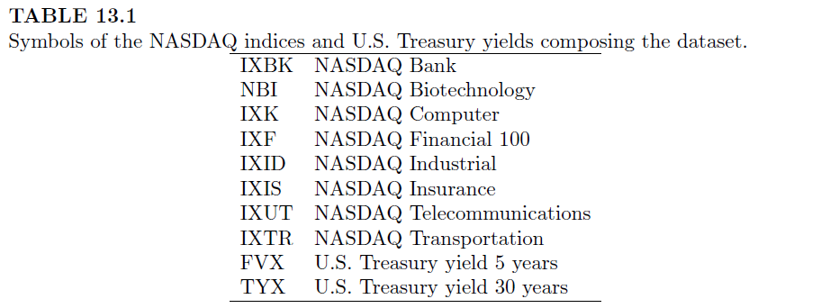

```{r echo=FALSE, warning=FALSE, purl=FALSE}
library(knitr)
```

```{r echo=FALSE}
## EST171 - Métodos Computacionais para Análise de Risco
## Código da aula 19 - Portfólios (parte 2)

```

```{r echo=FALSE, purl=FALSE}
file_name = "19-portfolios_pt2"
```


## Aula de Hoje

- Otimização de portfólios com Restrições
  - Retorno Alvo
  - Investimento Total
  - Posições *Long-only*
  - Restrições de grupo

- Modelo de Média-Variância
  - Exemplos
  
- Modelo de Média-Variância Robusto

- Modelo de Mínima Variância


## Otimização de portfólios

- <span class="black">**Otimização de portfólios**</span> consiste em *minimizar* uma medida de risco dado um retorno alvo e restrições operacionais.

- Vamos ver primeiro como implementar alguns tipos comuns de restrições.

- Em seguida, vamos ver o Modelo de Média-Variância, em que a medida de risco é dada pela matriz de covariância do portfólio, e algumas variações deste modelo ilustrados por exemplos.


## Otimização de portfólios | Restrições

- Além das medidas de risco, outro ponto importante da otimização de portfólios é a **especificação das restrições** operacionais ou preferenciais.

- Antes de mostrar os exemplos, vamos ver alguns tipos de restrições que são comuns em alocação de portfólios, e como implementá-las como funções do R.

```{r include=FALSE}
## Pacotes necessários
# install.packages("robustbase")
require(robustbase)

## Executar o código da aula passada
file = "../labs/18-portfolios.R"
source(file)

```


## Restrições | <span class="black">*Target Reward* (retorno alvo)</span>

- Essa restrição vem do objetivo de atingir um **retorno alvo** com a alocação do portfólio.

- A restrição é dada por:

$$\mu'\mathbf{w} = \bar{r} $$

onde $\mu$ é o vetor de retornos médios dos componentes do portfólio, $\mathbf{w}$ são os pesos que desejamos calcular, e $\bar{r}$ é o retorno alvo.


## Restrições | <span class="black">*Target Reward* (retorno alvo)</span>

- Para implementar essa restrição no R, vamos considerar a matriz $\mathbf{A}_{eq}$ e o vetor $\mathbf{a}_{eq}$ (da aula passada).

$$ \mathbf{A}_{eq} \,\mathbf{x} = \mathbf{a}_{eq} $$

```{r}

## Restrição Retorno Alvo
targetReturn <- function(x, target) {
  list(Aeq = rbind(colMeans(x)), aeq = target)
}

```


## Restrições | <span class="black">*Full Investment* (investimento total)</span>

- Essa restrição diz que o capital deve estar todo investido no portfólio. 

- Corresponde à condição na qual a soma dos pesos $\mathbf{w}$ deve ser 100%, onde os pesos correspondem à proporção do capital a ser alocado para cada componente.

$$ \mathbf{A}_{eq} \,\mathbf{x} = \mathbf{a}_{eq} $$
```{r}
## Restrição Investimento Total
fullInvest <- function(x) {
  list(Aeq = matrix(1, nrow = 1, ncol = ncol(x)), aeq = 1)
}

```


## Restrições | <span class="black">*Long Only* (posições compradoras)</span>

- Essa restrição especifica que o fundo só pode operar com posições compradoras (*long* = [operar "comprado"](http://defendaseudinheiro.com.br/operar-comprado-versus-operar-vendido)), isto é, vai receber mais com a valorização dos ativos.

- Isso é diferente de operar "vendido" (*short*), por exemplo com empréstimo de ações, em que você ganha com a desvalorização dos ativos. Nesse caso, os pesos dos ativos seriam negativos.

- Assim, de acordo com essa restrição, os pesos só podem ser positivos.


## Restrições | <span class="black">*Long Only* (posições compradoras)</span>

$$ \mathbf{A} \,\mathbf{x} \geq \mathbf{a} $$

```{r}
## Restrição Long Only
longOnly <- function(x) {
  list(A = diag(1, ncol(x)), a = rep(0, ncol(x)))
}

```


## Restrições | <span class="black">Restrições de grupo</span>

- Essas restrições são derivadas de restrições operacionais que obrigam um investidor a ter uma porcentagem mínima/máximo dos ativos em um determinado grupo de ações.

- Por exemplo:

  - no máximo 10% do portfólio pode estar no setor financeiro ou de bancos;
  
  - no máximo 30% do portfólio pode estar em um único ativo;
  
  - no mínimo 10% do portfólio deve estar investido no tesouro nacional.


## Dados índices NASDAQ

- Para isso, vamos usar os seguintes índices (Capítulo 13):

```{r fig.align='center', echo=FALSE, purl=FALSE}

``` 

* FVX = United States 5-Year Bond Yield; \
* TYX = United States 30-Year Bond Yield


## Dados índices NASDAQ

- Foram extraídos o valor de cada índice entre 01/03/2020 e 01/03/2021 (site: <https://www.investing.com>)

```{r results='hide'}
## Dados NASDAQ
file = "../datasets/nasdaq.csv"
nas = read.csv(file, colClasses = c("Date", rep("numeric",10)))
head(nas)
id = names(nas)[-1]

## calcular retornos
x <- apply(nas[,-1], MAR=2, function(x) x[-1] / x[-length(x)] - 1)
dim(x)

```


## 

```{r}
## Restrição de Grupo
GroupBudget <- function() {
  # max 10\% in financial and bank sector
  A1 <- matrix(0, ncol = length(id), nrow = 1)
  colnames(A1) <- id
  A1[1, c("IXBK", "IXF")] <- -1
  a1 <- -0.1
  
  # max 30\% in a single instrument
  A2 <- diag(-1, length(id))
  a2 <- rep(-0.3, length(id))
  
  # at least 10\% in treasury
  A3 <- matrix(0, ncol = length(id), nrow = 1)
  colnames(A3) <- id
  A3[1, c("FVX", "TYX")] <- 1
  a3 <- 0.1
  list(A = rbind(A1, A2, A3), a = c(a1, a2, a3))
}

```


# Modelo de Média-Variância


## 

O **Modelo de Média-Variância** é um modelo de otimização (Markowitx, 1953) que assume que:

- o portfólio consiste em ativos de risco e ativos sem risco;
- os preços dos ativos são dados e determinados externamente;
- os investidores não influenciam no preço dos ativos;
- os retornos seguem processos estocásticos com distribuições de probabilidade elípticas (parecida com a normal multivariada), o que quer dizer que existe uma matriz de covariância;
- não considera taxas e custos de transações;
- os mercados para todos os ativos são líquidos (é possível convertê-los em dinheiro facilmente);
- os ativos são infinitamente divisíveis;
- e é preciso fazer investimento total.


## Modelo de Média-Variância

- A <span class="red3">medida de risco</span> proposta por Markowitz é uma **matriz de covariância dos ativos ponderada**:

$$\mathbf{w}'\, \Sigma \, \mathbf{w} = \sum_i \sum_j w_i \,. w_j \,. \mbox{Cov}(\mathbf{x}_i,\mathbf{x}_j)  $$
onde $\Sigma$ é a matriz de covariância e $\mathbf{w}$ são os pesos do portfólio.


## Modelo de Média-Variância

- A otimização é obtida definindo-se um **retorno alvo** $\bar{r}$, e as restrições de investimento total e *long-only*, tal que:

$$\mbox{minimize}_{\mathbf{w}} \qquad \mathbf{w}'\,\Sigma \,\mathbf{w} \qquad \mbox{(risco covariância)} \\[.5cm]
\mbox{sujeito a } \qquad \mathbf{w}' \hat{\mu} = \bar{x} \qquad \mbox{(retorno alvo)} \\
\qquad \qquad \qquad \qquad \ \mathbf{w}' \mathbf{1} = 1 \qquad \mbox{(investimento total)} \\
\qquad \qquad \quad \, \mathbf{w} \geq 0 \qquad (long \;only) $$

onde $\hat{\mu}$ é o vetor dos retornos médios.


## Modelo de Média-Variância

- Esse problema não pode ser resolvido analiticamente, por isso precisamos de um algoritmo de otimização.

- O **Modelo de Média-Variância** é representado por um problema de Otimização Quadrática.

- Vamos usar a função `QP_solver` definida na última aula.


## 

```{r}

## Modelo de Média-Variância 
MV_QP <- function(x, target, Sigma = cov(x), ...,
                  cstr = c(fullInvest(x), targetReturn(x, target), longOnly(x), ...),
                  trace = FALSE) {
  
  # quadratic coefficients
  size <- ncol(x)
  c <- rep(0, size)
  Q <- Sigma
  
  # optimization
  sol <- QP_solver(c, Q, cstr, trace)
  
  # extract weights
  weights <- sol$solution
  names(weights) <- colnames(x)
  weights
}

```


## Modelo de Média-Variância

- Na função `MV_QP`, `x` são os retornos dos ativos, `target` é o retorno alvo do portfólio, e `Sigma` é o estimador clássico de covariância.

- Os demais argumentos são apenas usados para passar as restrições para o problema de otimização.


## Modelo de Média-Variância | <span class="green3">**Exemplo**</span>

- Esse modelo pode ser implementado de algumas maneiras diferentes.

- Vamos testar primeiro o modelo para encontrar os pesos que minimizam a medida de risco usando a média dos retornos de um portfólio uniforme (pesos iguais) como retorno alvo.

```{r}
## Exemplo - retorno alvo = média dos retornos
w <- MV_QP(x, target=mean(x))
round(w,4) # pesos 'ótimos'
```


## Modelo de Média-Variância | <span class="green3">**Exemplo**</span>

```{r results='hide'}
## restrições atendidas?
all.equal( c( t(w)%*%col_means(x) ) , mean(x) )   # retorno alvo
all.equal( sum(w) , 1 )                           # investimento total 
# sum(w) == 1
all(round(w,10) >= 0)                                       # long only

```


## Modelo de Média-Variância | <span class="green3">**Exemplo**</span>

- Pesos que minimizam o risco e atingem o retorno médio:

```{r echo=FALSE, fig.align='center', fig.height=4}
## gráfico com os pesos de cada ativo
barplot(w, ylim = c(0, 1), las = 2, main = "Test MV Implementation")

```


## Modelo de Média-Variância | <span class="green3">**Exemplo**</span>

```{r results='hide'}
## modelo de média-variância
t(w)%*%cov(x)%*%w   # covariância
t(w)%*%col_means(x) # retorno

## modelo de pesos uniformes
u = rep(1/10,10)
t(u)%*%cov(x)%*%u   # covariância
t(u)%*%col_means(x) # retorno

```


## Modelo de Média-Variância | <span class="green3">**Exemplo**</span>

- Vamos fazer outro teste para o nosso modelo. 

- Vamos ver o que acontece quando definimos o retorno alvo como o menor retorno médio dentre os ativos.

```{r}
## Exemplo - retorno alvo = retorno médio mínimo
which(col_means(x)==min(col_means(x)))

```


## Modelo de Média-Variância | <span class="green3">**Exemplo**</span>

```{r results='hide'}
w <- MV_QP(x, target=min(col_means(x)))
round(w, 4)

```

```{r echo=FALSE, fig.align='center', fig.height=4}
## gráfico com os pesos de cada ativo
barplot(w, ylim = c(0, 1), las = 2,
        main = "Smallest Portfolio Return")

```


## Modelo de Média-Variância | <span class="green3">**Exemplo**</span>

```{r results='hide'}
## restrições atendidas?
all.equal( c(t(w)%*%col_means(x)) , min(col_means(x)) )  # retorno alvo
all.equal(sum(w) , 1)                                    # investimento total 
all(round(w,10) >= 0)                                     # long only
# all(w >= 0)

```

```{r echo=FALSE}
## Exercício - retorno alvo = retorno médio máximo
## Repita a análise do exemplo anterior fixando o retorno alvo
## como o retorno médio individual de maior valor.
## O que acontece com a alocação dos pesos?

```


## Modelo de Média-Variância 

- Até agora, para rodar a função de otimização de acordo com o Modelo de Média-Variância, só especificamos a matriz de retornos `x` e o valor do retorno alvo `target`.

```{r purl=FALSE}
args(MV_QP)
```

- O argumento `cstr` passa as restrições *default* de investimento total, retorno alvo e *long-only*. Vamos ver agora como especificar mais condições, como as restrições de grupo.


## Modelo de Média-Variância | <span class="green3">**Exemplo**</span>

```{r}
## Exemplo - restrições de grupo
w <- MV_QP(x, mean(x), Sigma = covMcd(x)$cov, GroupBudget())

```

```{r echo=FALSE, fig.align='center', fig.height=4}
## gráfico com os pesos de cada ativo
barplot(w, ylim = c(0, 1), las = 2,
        main = "MV with Budget Constraints")
```


# Modelo de Média-Variância Robusto


## Modelo de Média-Variância Robusto

- Uma desvantagem do Modelo de Média-Variância é o uso da matriz de covariância para estimar o risco. 

- O problema é que a matriz de covariância amostral é sensível à presença de *outliers*, que aparecem frequentemente em dados financeiros.

- Como passamos a matriz de covariância `Sigma=cov(x)` como argumento para a função `MV_QP()`, uma modificação simples do Modelo de Média-Variância é utilizar um estimador de covariância mais robusto.

- Vamos usar a função `covMcd()`, do pacote `robustbase`, que implementa o método do determinante de covariância mínima (*Minimum Covariance Determinant*) proposto por Rousseeuw & Driessen (1999). Esse método fornece um estimador mais robusto (menos sensível a *outliers*) para a <span class="red3">covariância</span>.


## Modelo de Média-Variância Robusto

- Comparação dos pesos do método clássico e do método robusto:

```{r echo=FALSE, fig.align='center'}
## Comparação de pesos
w1 <- MV_QP(x, mean(x), Sigma = cov(x))         # método clássico
w2 <- MV_QP(x, mean(x), Sigma = covMcd(x)$cov)  # método robusto

## Gráficos
par(mfrow=c(1,2))
barplot(w1, ylim = c(0, 1), las = 2, main = "MV with classical cov")
barplot(w2, ylim = c(0, 1), las = 2, main = "MV with robust cov")

```


# Modelo de Mínima Variância


## Modelo de Mínima Variância

- Outro ponto criticado do Modelo de Média-Variância é o uso do retorno médio dos componentes do portfólio como retorno alvo.

- Já foi mostrado que um erro no estimador da média pode suprimir os benefícios da otimização dos pesos, ou seja, um efeito de *outliers* no retorno médio pode levar a pesos inapropriados.

- Assim, podemos considerar um <span class="black">**Modelo de Mínima Variância**</span> que otimiza os pesos apenas levando em conta a minimização da covariância sem fixar o retorno alvo.


## Modelo de Mínima Variância

```{r}

## Modelo de Mínima Variância
w <- MV_QP(x, cstr = c(fullInvest(x), longOnly(x)))
```

```{r echo=FALSE, fig.align='center', fig.height=4}
## gráfico com pesos
barplot(w, ylim = c(0, 1), las = 2, main = "Minimum Variance Portfolio")

```


## Outros Modelos de Alocação

- Além da matriz de covariância, existem outras alternativas para a <span class="red3">**medida de risco**</span>. Uma medida popular é o **VaR** (*Value-at-Risk*).

-  O **VaR** é uma medida de risco probabilística. Por exemplo, um **VaR** ao nível de $p\%$ é o valor tal que a probabilidade de uma perda maior do que ele seja menor ou igual a $p$.

- Mais detalhes e exemplos: Seção 13.5.5


## Outros Modelos de Alocação

- Os modelos que consideramos aqui têm apenas restrições lineares. No entanto, em alguns cenários, a alocação de pesos de um portfólio pode requerer **otimização sob restrições não-lineares**. 

- Por exemplo, um investidor pode estar interessado em minimizar a **redução do valor do seu portfólio**. A definição de redução do valor do portfólio, e um exemplo podem ser vistos na Seção 13.5.6.


## Comparação de portfólios

- Por fim, podemos estar interessados em comparar a performance de portfólios com alocações diferentes. Essas comparações podem ser feitas através das medidas de retorno e medidas de risco.

- Alguns exemplos de como fazer essas comparações estão na Seção 13.6.


[//]: # ##########################################################
[//]: # Para gerar arquivo com apenas os comandos do R desta aula
```{r include=FALSE, purl=FALSE}
# gerar arquivo com comandos do R
purl(input=paste0(file_name,".Rmd"),
     output=paste0("../labs/",file_name,".R"),
     documentation=0, encoding='UTF-8')
# Saída: 'filename.R' com apenas o código extraído do arquivo original
# Opções: documentation=1 inclui o texto no título dos chunks
# Para excluir um chunk do arquivo final, incluir a opção purl=FALSE no cabeçalho do chunk
```


